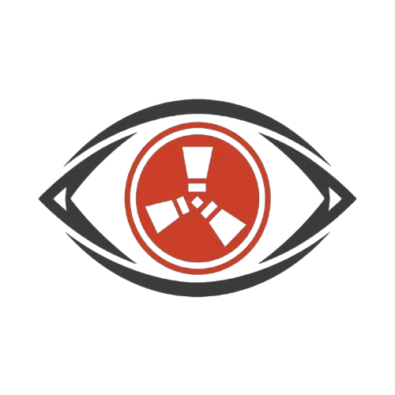

# Rustalker

<p align="center">
  
</p>

<p align="center">
  <strong>Discord bot for Rust + BattleMetrics</strong><br>
  Track servers, watch players, get tactical alerts and activity analysis — all from a single panel.
</p>

---

## What is Rustalker?

Rustalker is a Discord bot built for Rust clans, server admins and competitive teams who want to centralise their tactical intelligence using BattleMetrics and Rust+.

With Rustalker you can:

- Monitor BattleMetrics servers in real time.
- Watch players and receive instant connection / disconnection alerts.
- Register clans and their members.
- Generate hourly activity statistics with dark-style charts.
- Calculate optimal offline windows for raids.
- Connect directly to your Rust server via **Rust+** (WebSocket) for live alarms, team chat relay and Smart Switch control.

## Stack

- Python 3.11+
- discord.py ≥ 2.4
- aiohttp
- aiosqlite
- matplotlib
- python-dotenv
- rustplus ≥ 6.0

## Features

- Modern slash commands with Discord's app commands framework.
- SQLite database created automatically on first run.
- Real-time alerts routed to configurable channels and role mentions.
- Interactive player selector when multiple BattleMetrics results match.
- Dark-themed activity charts generated with matplotlib.
- Limited mode if `BATTLEMETRICS_TOKEN` is not set.
- **Rust+ integration** (optional): persistent WebSocket connections per server for Smart Alarms, team chat relay and Smart Switch toggling.

## Requirements

- Python 3.11 or higher.
- A bot application created in the [Discord Developer Portal](https://discord.com/developers/applications).
- A BattleMetrics API token is strongly recommended.
- A Rust+ player token is required for the Rust+ integration (see below).

## Installation

### 1. Clone the repository

```bash
git clone <YOUR_REPOSITORY_URL>
cd Rustalker
```

### 2. Create and activate a virtual environment

```bash
python -m venv .venv
.venv\Scripts\activate        # Windows
source .venv/bin/activate     # macOS / Linux
```

### 3. Install dependencies

```bash
pip install -r requirements.txt
```

### 4. Configure the `.env` file

Copy `.env.example` to `.env` and fill in the values:

```env
DISCORD_BOT_TOKEN=your_discord_bot_token
BATTLEMETRICS_TOKEN=your_battlemetrics_token
DATABASE_PATH=rustalker.db
```

If you omit `BATTLEMETRICS_TOKEN` the bot will start in limited mode and several commands won't be able to retrieve data.

### 5. Create the bot in Discord

1. Go to the [Discord Developer Portal](https://discord.com/developers/applications).
2. Create a new application.
3. Navigate to the **Bot** section and create the bot.
4. Copy the token and paste it into `DISCORD_BOT_TOKEN`.

### 6. Invite the bot to your server

Use an OAuth2 link with at minimum these permissions:

- `applications.commands`
- `Send Messages`
- `Embed Links`
- `Attach Files`
- `Read Message History`

Make sure the bot has access to any channels where you want alerts to be posted.

### 7. Run the bot

```bash
python main.py
```

The SQLite database file will be created automatically at the path defined by `DATABASE_PATH`.

---

## Usage Guide

### Initial setup

1. Run `/setup_alerts` to define the channel where alerts will be sent.
2. Optionally add a role to be mentioned in critical alerts.
3. Run `/setup_rules` to fine-tune tactical thresholds.

```text
/setup_alerts channel:#alerts role_mention:@Raid Team
/setup_rules spike_window:15 spike_threshold:3 queue_threshold:5
```

### Server monitoring

1. Use `/server_track` with the BattleMetrics URL or server ID.
2. The bot will start checking the map, queue, population and watched players.
3. Use `/server_untrack` to stop monitoring a server.

```text
/server_track target:https://www.battlemetrics.com/servers/rust/123456
/server_untrack server_id:123456
```

### Player watchlist

1. Add players with `/watch`.
2. Attach notes and a custom alert channel per player.
3. Check current status with `/watchlist`.
4. Remove a player with `/unwatch`.

```text
/watch target:PlayerName notes:"Enemy clan leader" custom_channel:#tracking
```

### Clans

1. Create a clan with `/clan create`.
2. List all clans with `/clan list`.
3. Add or remove members with `/clan add_member` and `/clan remove_member`.

### Analysis

- `/check_player` — shows the complete player profile.
- `/stats` — generates an hourly activity chart for the last N days.
- `/raid_predictor` — calculates the optimal offline raid window.

---

## Commands

### BattleMetrics / Monitoring

| Command | Description |
| --- | --- |
| `/tuto` | Shows the quick-start guide inside Discord |
| `/setup_alerts` | Configures the alerts channel and mention role |
| `/setup_rules` | Adjusts tactical alert thresholds |
| `/server_track` | Starts monitoring a BattleMetrics server |
| `/server_untrack` | Stops monitoring a server |
| `/watch` | Adds a player to the watchlist |
| `/unwatch` | Removes a watched player |
| `/watchlist` | Lists all watched players and their status |
| `/check_player` | Looks up a player's full profile |
| `/stats` | Generates an hourly activity chart |
| `/raid_predictor` | Calculates the optimal offline raid window |
| `/clan create` | Creates a new clan |
| `/clan list` | Lists all saved clans |
| `/clan add_member` | Adds a member to a clan |
| `/clan remove_member` | Removes a member from a clan |

### Rust+ (Direct server integration)

| Command | Description |
| --- | --- |
| `/rustplus pair` | Pairs the bot with a Rust server via Rust+ |
| `/rustplus unpair` | Removes a pairing and disconnects the socket |
| `/rustplus list` | Lists all pairings and their connection status |
| `/rustplus server_info` | Shows live server info (players, map, seed, time) |
| `/rustplus team_info` | Shows team members and their online/offline status |
| `/rustplus send_message` | Sends a message to the in-game team chat |
| `/rustplus alarm_add` | Registers a Smart Alarm entity |
| `/rustplus alarm_remove` | Removes a registered alarm |
| `/rustplus alarm_list` | Lists all alarms for a pairing |
| `/rustplus switch_add` | Registers a Smart Switch entity |
| `/rustplus switch_remove` | Removes a registered switch |
| `/rustplus switch_on` | Turns a Smart Switch ON from Discord |
| `/rustplus switch_off` | Turns a Smart Switch OFF from Discord |
| `/rustplus reconnect` | Disconnects and reconnects the socket for a pairing |

---

## Rust+ Integration

Rustalker can connect directly to your Rust server through the Rust+ companion protocol (WebSocket) without needing server admin access or any server-side mods.

### How to obtain your `player_token`

1. Download the official **Rust+** app on your phone.
2. In-game, open the menu and pair your base with the app.
3. Use one of the following methods to capture the generated token:
   - A community browser extension linked in the rustplus.py documentation.
   - Access the `player.tokens.db` SQLite file if you are a server admin.
4. Once you have the token, use `/rustplus pair` in Discord.

### Typical workflow

```text
1. /rustplus pair ip:123.45.67.89 port:28082 steam_id:76561198XXXX player_token:XXXXX
2. /rustplus alarm_add pairing_id:1 entity_id:123456 label:"Front door" channel:#alerts
3. /rustplus switch_add pairing_id:1 entity_id:789012 label:"Auto turrets"
4. /rustplus switch_on pairing_id:1 entity_id:789012   → Turrets activated from Discord!
```

### Real-time features

- **Raid alerts:** When a Smart Alarm triggers (explosion, intruder), the bot instantly sends an alert embed to the configured channel.
- **Team chat relay:** In-game team chat messages are automatically forwarded to a Discord channel, and vice-versa via `/rustplus send_message`.
- **Device control:** Toggle turrets, generators or traps directly from Discord buttons.

> **Note:** The Rust+ Companion port (default `28082`) is **different** from the game port (usually `28015`).

---

## Project Structure

```
Rustalker/
├── main.py               # Bot entry point and extension loader
├── battlemetrics.py      # Async BattleMetrics API client
├── database.py           # SQLite layer and schema (includes Rust+ tables)
├── requirements.txt
├── .env.example
├── assets/
│   └── rustalker.png     # Bot logo
└── cogs/
    ├── commands.py       # Slash commands and analysis utilities
    ├── tracker.py        # Background tasks for BattleMetrics alerts
    └── rustplus_cog.py   # Full Rust+ integration via WebSocket
```

## Notes

- Global slash command sync may take a few minutes to propagate across Discord.
- If the bot is unresponsive, check the Discord token and network access to BattleMetrics.
- The database file can be deleted to start fresh.
- The Rust+ integration is **optional**: if `rustplus` is not installed or no pairing is configured, the rest of the bot works normally.
